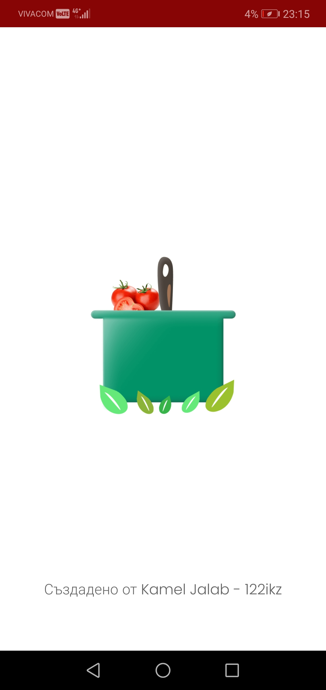
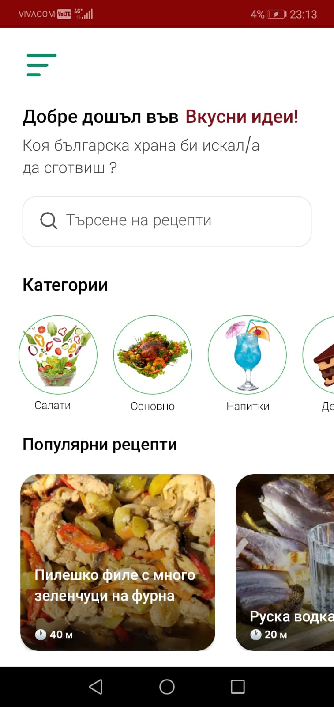
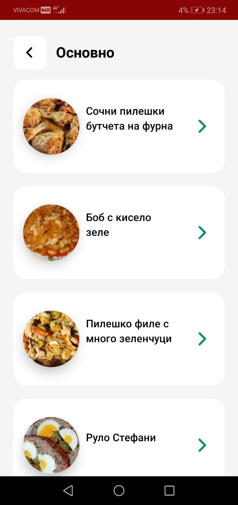
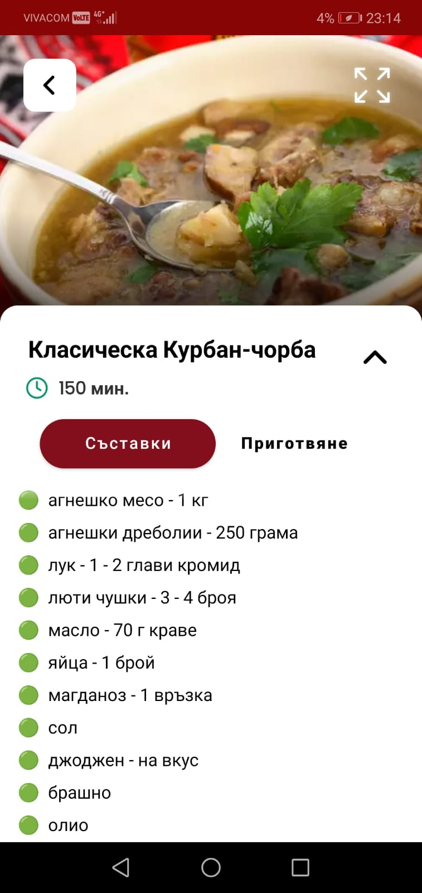
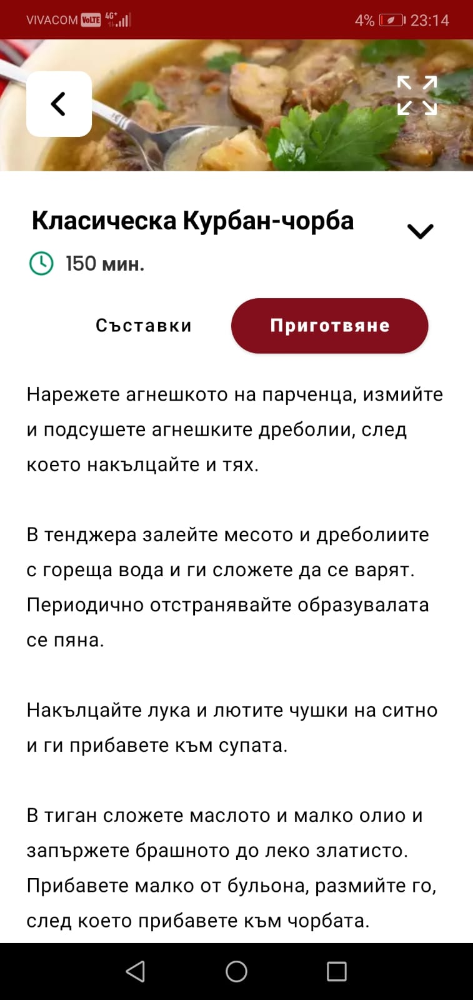
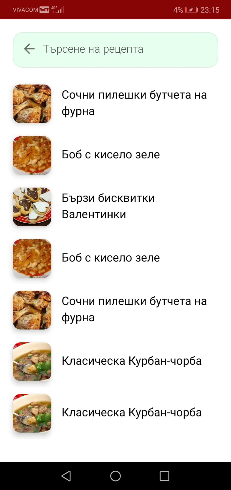

# app-recepti-android

# Приложение за рецепти с модерен потребителски интерфейс

Това приложение предоставя широк набор от рецепти, които са лесни за следване и перфектни за всякакви поводи. С помощта на предварително попълнена ROOM база данни, потребителите могат да разглеждат рецепти, които включват подробни инструкции, изображения и стъпки за приготвяне. Създадено с мисъл за хората, които искат да експериментират в кухнята или просто да приготвят бързо вкусни ястия, приложението предлага както офлайн достъп, така и опции за персонализиране на търсенето на рецепти.

## 📌 Ключови функции

- **Удобен дизайн**: Приложението е лесно за навигация, което позволява на потребителите бързо да намират това, което търсят.
- **Поддръжка на мултимедия**: Можете да добавяте снимки към рецептите, за да помогнете на потребителите да видят как се приготвя всяко ястие.
- **Разнообразие от рецепти**: Потребителите могат да разглеждат множество рецепти, което прави готвенето по-забавно.
- **Функция за търсене**: Потребителите могат лесно да намират рецепти.
- **Офлайн достъп**: Рецептите могат да се разглеждат дори без интернет връзка, което прави приложението удобно за всяко време.


## 📖 Ръководство за използване

1. **Инсталация**: След като клонирате репозитория, отворете проекта в Android Studio и стартирайте приложението на вашето устройство или емулатор.
2. **Навигация**: Приложението предлага лесна навигация между различни категории рецепти и е лесно за използване.
3. **Търсене**: Можете да използвате функцията за търсене, за да намерите рецепти по ключови думи, като съставки или категории.


## 📥 Инсталация

1. Клонирайте репозитория:
   
   ```bash
   
   git clone https://github.com/KamelJalab/app-recepti-android.git


💻 Технологии

ROOM Database

Java

Android SDK

## 🚀 Подобрения и планове за бъдеще

- Добавяне на възможност за създаване на персонализирани рецепти.
- Включване на функция за споделяне на рецепти със социални мрежи.
- Подобряване на интерфейса за по-добро изживяване на потребителите.

## 📸 Снимки на приложението

<div style="display: flex; gap: 10px; flex-wrap: wrap; justify-content: center;">
  <div style="text-align: center; width: 220px;">
    
    <p style="font-size: 14px; color: #555; margin-top: 5px;">Зареждане на приложението</p>
  </div>
  <div style="text-align: center; width: 220px;">
    
    <p style="font-size: 14px; color: #555; margin-top: 5px;">Начало на приложението</p>
  </div>
  <div style="text-align: center; width: 220px;">
    
    <p style="font-size: 14px; color: #555; margin-top: 5px;">Категория</p>
  </div>
  <div style="text-align: center; width: 220px;">
    
    <p style="font-size: 14px; color: #555; margin-top: 5px;">Преглед на рецепта</p>
  </div>
  <div style="text-align: center; width: 220px;">
    
    <p style="font-size: 14px; color: #555; margin-top: 5px;">Стъпки на приготване</p>
  </div>
  <div style="text-align: center; width: 220px;">
    
    <p style="font-size: 14px; color: #555; margin-top: 5px;">Търсене</p>
  </div>
</div>


## 🌍 Поддръжка на езици

Приложението в момента поддържа следните езици:
- Български
- Английски (планирано за бъдещите версии)

